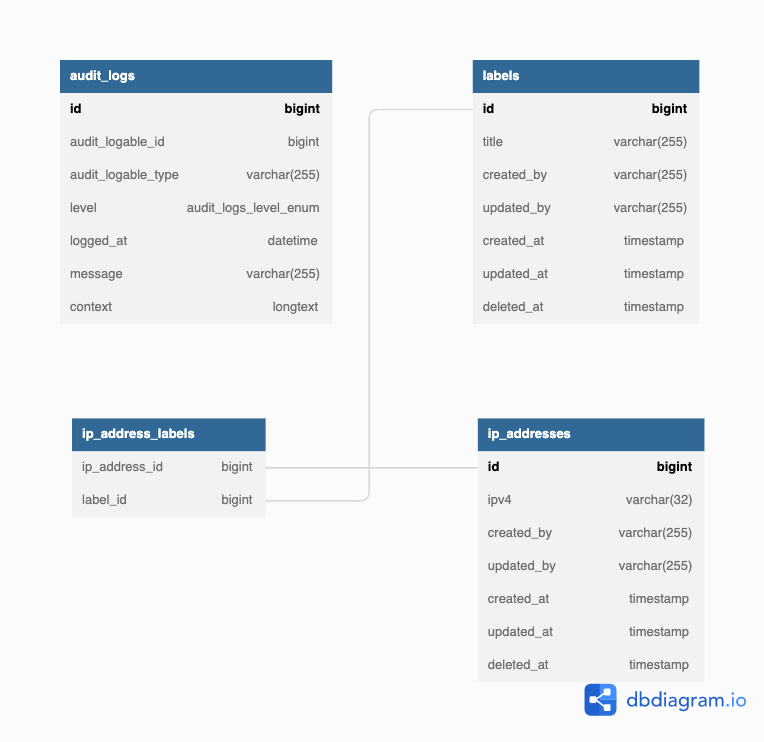
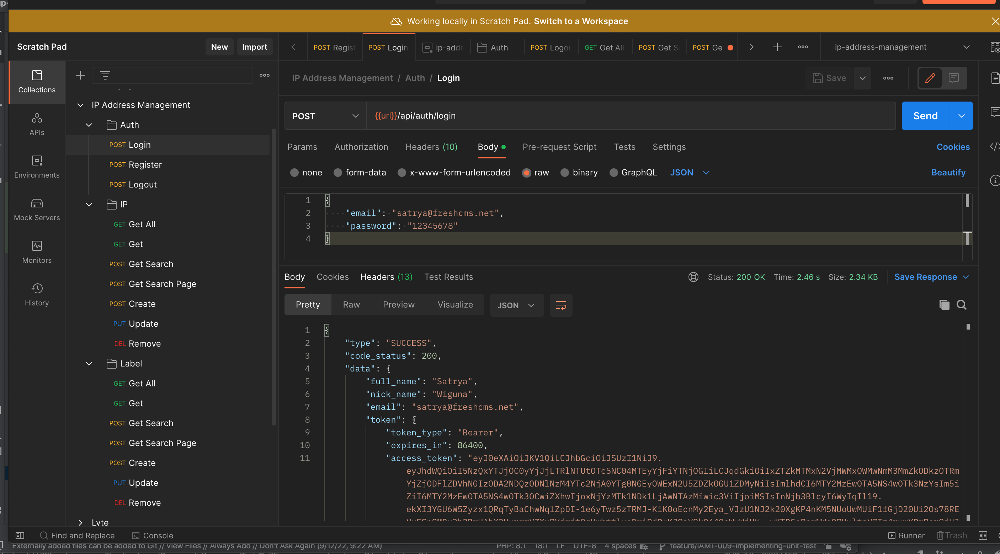

# ip-management-api

## Project setup
```
git clone https://github.com/satryawiguna/ip-address-management-api.git

cd into root project folder

run docker-compose up -d

docker exec -t -i iam_api php artisan migrate

docker exec -t -i iam_api php artisan passport:install --uuids
```

## Configuration
```
APP_NAME=IamApi
APP_ENV=local
APP_KEY=base64:guSuTW3PMI3zGjY7pPu77WVfrNRiRYgyCPdrbRpoUNI=
APP_DEBUG=true
APP_URL=http://localhost:81/

DB_CONNECTION=mysql
DB_HOST=iam_mysql
DB_PORT=3306
DB_DATABASE=ip_address_management
DB_USERNAME=root
DB_PASSWORD=root
DB_TABLE_PREFIX=iam_

```

## Documentation Api
```
Import file documentation on root project directory "IP Address Management.postman_collection.json" into POSTMAN
```
Download file document [here](IP Address Management.postman_collection)


## Attachment


  


